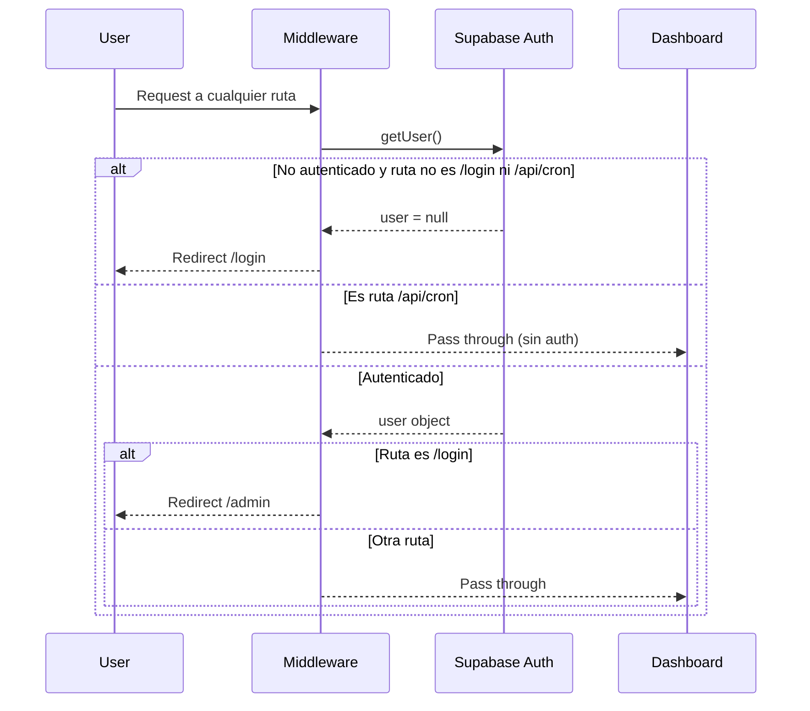
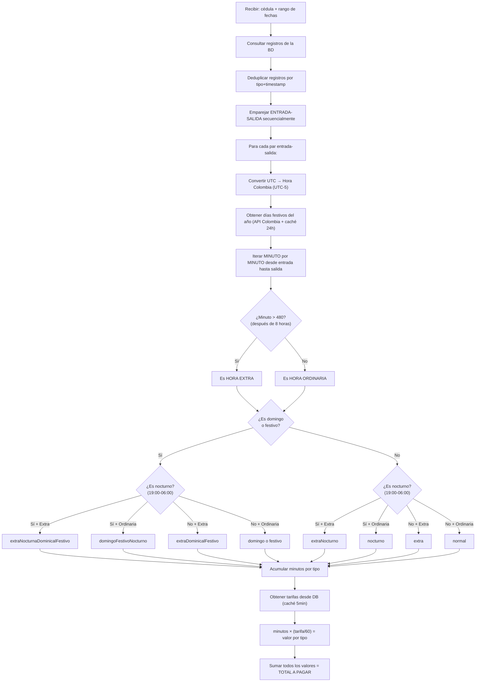

# 📘 Guía Técnica Completa — Inlotrans Asistencia V2

> **Versión:** 1.1  
> **Fecha:** 2026-04-01  
> **Última Actualización:** Optimización de rendimiento, corrección de CRON, mejora de filtros  
> **Aplicación:** Sistema de Control de Asistencia para la empresa Inlotrans (logística y transporte)  
> **Propósito:** Documentación exhaustiva de arquitectura, lógica de negocio, módulos, flujos de datos, base de datos, cálculos de horas y exportaciones.

---

## 1. Stack Tecnológico

| Capa | Tecnología | Versión |
|------|-----------|---------|
| **Framework** | Next.js (App Router) | 16.1.6 |
| **Runtime** | React | 19.2.3 |
| **Lenguaje** | TypeScript | ^5 |
| **Base de Datos** | Supabase (PostgreSQL) | Cloud |
| **ORM / Client** | @supabase/supabase-js + @supabase/ssr | 2.97 / 0.8 |
| **Estilos** | TailwindCSS v4 + tw-animate-css | ^4 |
| **UI Library** | Radix UI + shadcn/ui | ^1.4 |
| **Formularios** | React Hook Form + Zod | 7.71 / 4.3 |
| **Notificaciones** | Sonner | 2.0 |
| **Excel** | ExcelJS (planos) + xlsx (SheetJS) (consolidados) | 4.4 / 0.18 |
| **Iconos** | Lucide React | ^0.575 |
| **Fechas** | date-fns | ^4.1 |
| **Hosting** | Vercel | - |
| **CRON** | Vercel Cron Jobs | Daily |

---

## 2. Estructura de Carpetas

```
asistence-v2/
├── .env.local                          # Variables de entorno (Supabase keys)
├── vercel.json                         # Config de Vercel CRON Jobs
├── next.config.ts                      # Configuración Next.js  
├── components.json                     # Configuración shadcn/ui
├── package.json                        # Dependencias y scripts
├── supabase_migration_data.sql         # Dump de datos iniciales migrados
├── supabase-operaciones.sql            # DDL tabla operaciones + RLS policies
├── scripts/
│   └── migrate_railway_to_supabase.ts  # Script de migración desde Railway (legacy)
├── public/                             # Archivos estáticos (favicon)
└── src/
    ├── middleware.ts                    # Middleware de autenticación global
    ├── app/
    │   ├── layout.tsx                  # Root Layout (fuentes, Toaster global)
    │   ├── globals.css                 # Estilos globales de Tailwind
    │   ├── page.tsx                    # 🏠 KIOSCO: Formulario de registro de asistencia
    │   ├── actions.ts                  # Server Actions del Kiosco
    │   ├── login/
    │   │   ├── page.tsx                # Página de login (Supabase Auth)
    │   │   └── actions.ts              # login(), signup(), signout()
    │   ├── (dashboard)/                # Route Group protegido con layout autenticado
    │   │   ├── layout.tsx              # Dashboard Layout (sidebar + protección auth)
    │   │   ├── page.tsx                # Dashboard home (KPIs placeholder)
    │   │   ├── empleados/              # 👥 Gestión de Empleados
    │   │   │   ├── page.tsx            # Server Component: lista y formulario
    │   │   │   ├── EmpleadoForm.tsx    # Client Component: formulario de creación
    │   │   │   ├── EmpleadosTable.tsx  # Client Component: tabla + edición + toggle estado
    │   │   │   └── actions.ts          # crearEmpleado(), editarEmpleado(), cambiarEstadoEmpleado()
    │   │   ├── novedades/              # 📋 Novedades (auxilios, incapacidades)
    │   │   │   ├── page.tsx            # Server Component: historial + formulario
    │   │   │   ├── NovedadesForm.tsx   # Client Component: formulario condicional
    │   │   │   └── actions.ts          # crearNovedad(), eliminarNovedad(), buscarEmpleadoNombre()
    │   │   └── admin/                  # ⚙️ Administración y Reportes  
    │   │       ├── page.tsx            # Server Component: reporte de horas liquidado
    │   │       ├── AdminFilters.tsx    # Client Component: filtros de periodo/operación (multi-select dropdown)
    │   │       ├── AdminTablesClient.tsx # Client Component: renderizado de tablas de liquidación
    │   │       ├── AdminExcelButton.tsx# Client Component: botón dropdown de exportaciones
    │   │       ├── operaciones-actions.ts  # CRUD de operaciones + caché
    │   │       └── operaciones/        
    │   │           ├── page.tsx        # Server Component: CRUD de operaciones
    │   │           └── OperacionesClient.tsx # Client: tabla + modal create/edit/delete
    │   └── api/
    │       ├── exportar-excel/
    │       │   └── route.ts            # GET: Consolidad de horas → Excel (.xlsx SheetJS)
    │       ├── exportar-planos/
    │       │   └── route.ts            # GET: Planos contables → Excel (.xlsx ExcelJS)
    │       └── cron/
    │           └── autocierre/
    │               └── route.ts        # GET: Auto-cierre de jornadas abiertas >8h (corregido de POST→GET)
    ├── components/
    │   └── ui/                         # shadcn/ui components
    │       ├── badge.tsx, button.tsx, card.tsx, dialog.tsx
    │       ├── dropdown-menu.tsx, form.tsx, input.tsx, label.tsx
    │       ├── select.tsx, sonner.tsx, table.tsx, textarea.tsx
    └── lib/
        ├── utils.ts                    # cn() helper (clsx + tailwind-merge)
        ├── calculoHoras.ts             # ⚡ CORE: Cálculo de horas por minuto
        ├── supabase/
        │   ├── client.ts              # Supabase browser client  
        │   ├── server.ts              # Supabase server client (con cookies)
        │   └── middleware.ts           # updateSession() para middleware
        └── excel/
            ├── extras.ts              # Generador Excel: Plano de Extras/Recargos
            ├── auxilios.ts            # Generador Excel: Plano de Auxilios No Prestacionales
            ├── incapacidades.ts       # Generador Excel: Plano de Incapacidades
            └── ausentismos.ts         # Generador Excel: Plano de Ausentismos (cumpleaños)
```

---

## 3. Modelo de Base de Datos (Supabase/PostgreSQL)

### 3.1 Tabla `usuarios`

| Columna | Tipo | Descripción |
|---------|------|-------------|
| `id` | TEXT (PK) | Número de cédula del empleado (string, no UUID) |
| `nombre` | TEXT | Nombre completo en mayúsculas |
| `cargo` | TEXT | Cargo del empleado (ej: "COORDINADOR ADMINISTRATIVO") |
| `operacion` | TEXT | Operación base asignada (ej: "Administrativo J3") |
| `birthdate` | TIMESTAMPTZ | Fecha de nacimiento (para ausentismo por cumpleaños) |
| `status` | TEXT | `'activo'` o `'inactivo'` |
| `created_at` | TIMESTAMPTZ | Fecha de creación |
| `updated_at` | TIMESTAMPTZ | Última modificación |

> [!IMPORTANT]
> La PK es la cédula como TEXT, no un UUID. Esto implica que la cédula es inmutable y se usa como FK en las demás tablas.

### 3.2 Tabla `registros`

| Columna | Tipo | Descripción |
|---------|------|-------------|
| `row_number` | SERIAL (PK) | Identificador autoincremental |
| `id` | TEXT (FK→usuarios) | Cédula del empleado |
| `usuario_nombre` | TEXT | Nombre desnormalizado (snapshot al registrar) |
| `operacion` | TEXT | Operación donde se registró (puede diferir de la base) |
| `tipo` | TEXT | `'ENTRADA'` o `'SALIDA'` |
| `fecha_hora` | TIMESTAMPTZ | Timestamp del registro (UTC desde el server) |
| `foto_base64` | TEXT | Fotografía en base64 (campo nuevo, reemplaza `foto_url`) |
| `foto_url` | TEXT | URL legacy de Google Drive (campo deprecado) |
| `created_at` | TIMESTAMPTZ | Fecha de creación del registro |

> [!NOTE]
> **Emparejamiento:** Los registros se emparejan secuencialmente (ENTRADA→SALIDA) por usuario. Una ENTRADA sin SALIDA se considera "jornada abierta" y es candidata para el auto-cierre CRON.

### 3.3 Tabla `novedades`

| Columna | Tipo | Descripción |
|---------|------|-------------|
| `id` | SERIAL (PK) | ID autoincremental |
| `usuario_id` | TEXT (FK→usuarios) | Cédula del empleado |
| `usuario_nombre` | TEXT | Nombre desnormalizado |
| `tipo_novedad` | TEXT | `'auxilio_no_prestacional'` o `'incapacidad'` |
| `fecha_novedad` | DATE | Fecha principal de la novedad |
| `start_date` | DATE | Fecha inicio (para incapacidades) |
| `end_date` | DATE | Fecha fin (para incapacidades) |
| `razon` / `notas` | TEXT | Justificación o razón de la novedad |
| `valor_monetario` | NUMERIC | Valor COP (para auxilios) |
| `remunerable` / `es_remunerado` | BOOLEAN | Si afecta planilla directamente |
| `causa` / `causa_codigo` | INT | Código EPS de causa (ver tabla de causas) |
| `imagen_url` | TEXT | URL de soporte documental (legacy) |
| `fecha_registro` | TIMESTAMPTZ | Fecha del sistema al registrar |
| `created_at` | TIMESTAMPTZ | Fecha de creación |

> [!WARNING]
> **Inconsistencia detectada:** La inserción desde `actions.ts` usa los campos `razon`, `remunerable`, `start_date`, `end_date`, `causa`. Pero la visualización en `page.tsx` intenta leer `notas`, `es_remunerado`, `fecha_inicio`, `fecha_fin`, `causa_codigo`. Esto sugiere una posible incompatibilidad de nombres de campos entre el esquema de BD y lo que la UI espera renderizar.

### 3.4 Tabla `tarifas`

| Columna | Tipo | Descripción |
|---------|------|-------------|
| `id` | INT (PK) | ID de la tarifa |
| `tipo_hora` | TEXT | Clave única: `normal`, `extra`, `nocturno`, etc. |
| `precio_por_hora` | NUMERIC | Valor COP por hora de ese tipo |
| `descripcion` | TEXT | Descripción legible |
| `activo` | BOOLEAN | Si la tarifa está vigente |
| `fecha_inicio` | TIMESTAMPTZ | Inicio de vigencia |
| `fecha_fin` | TIMESTAMPTZ | Fin de vigencia (null = sin fin) |

**Tarifas actuales (2026):**

| Tipo | Código en DB | Precio/Hora (COP) | Recargo |
|------|-------------|-------------------|---------|
| Normal | `normal` | $7,959 | 100% (base) |
| Extra Ordinaria | `extra` | $9,948 | 125% |
| Nocturna | `nocturno` | $10,745 | 135% |
| Extra Nocturna | `extraNocturno` | $13,928 | 175% |
| Dominical | `domingo` | $14,326 | 175% |
| Festiva | `festivo` | $14,326 | 175% |
| Dom/Festivo Nocturno | `domingoFestivoNocturno` | $17,111 | 210% |
| Extra Dom/Festivo | `extraDominicalFestivo` | $17,111 | 200% |
| Extra Noct Dom/Fest | `extraNocturnaDominicalFestivo` | $21,091 | 250% |

### 3.5 Tabla `operaciones`

| Columna | Tipo | Descripción |
|---------|------|-------------|
| `id` | UUID (PK) | ID generado automáticamente |
| `nombre` | TEXT UNIQUE | Nombre de la operación (ej: "Multidimensionales") |
| `status` | BOOLEAN | Activa o inactiva |
| `created_at` | TIMESTAMPTZ | Fecha de creación |

**RLS:** Lectura pública (anon), escritura solo usuarios autenticados.

---

## 4. 🔑 Autenticación y Middleware

### 4.1 Flujo de Autenticación



### 4.2 Componentes de Auth

- **`src/middleware.ts`**: Intercepta todas las rutas (excepto estáticos). Llama a `updateSession()`.
- **`src/lib/supabase/middleware.ts`**: Función `updateSession()` que:
  1. Crea un `createServerClient` con las cookies de la request
  2. Llama `getUser()` para validar la sesión
  3. **Bypass de rutas CRON:** Las rutas `/api/cron/*` pasan sin autenticación (Vercel las llama sin sesión de usuario)
  4. Redirige a `/login` si no hay usuario (incluye la ruta `/` del kiosco)
  5. Redirige a `/admin` si el usuario ya autenticado intenta acceder a `/login`
- **`src/lib/supabase/server.ts`**: Factory `createClient()` para Server Components y Server Actions. Usa `cookies()` de Next.js.
- **`src/lib/supabase/client.ts`**: Factory `createClient()` para componentes del browser (no usado actualmente).
- **`src/app/login/actions.ts`**: Acciones `login()`, `signup()`, `signout()`.

> [!IMPORTANT]
> La ruta raíz `/` (Kiosco) **requiere autenticación** intencionalmente. Esto se decidió para evitar que empleados registren asistencia desde su casa. El kiosco debe usarse solo desde terminales físicos autenticados en la ubicación de trabajo.

> [!NOTE]
> Las rutas `/api/cron/*` están **excluidas** del middleware de autenticación para que Vercel pueda invocarlas correctamente vía GET sin sesión de usuario.

### 4.3 Protección del Dashboard

El layout `(dashboard)/layout.tsx` realiza una **doble verificación** de autenticación:
```typescript
const { data: { user } } = await supabase.auth.getUser()
if (!user) { redirect('/login') }
```

---

## 5. ⚡ CÁLCULO DE HORAS — Lógica Central

> [!IMPORTANT]
> Este es el corazón del sistema. Reside en `src/lib/calculoHoras.ts` (414 líneas). La lógica calcula MINUTO A MINUTO el tipo de cada minuto trabajado.

> [!TIP]
> **Optimización v1.1 (2026-04-01):** Todas las consultas a la tabla `registros` usan selección explícita de columnas: `id, usuario_nombre, operacion, tipo, fecha_hora`. Anteriormente se usaba `select('*')`, lo que incluía la columna `foto_base64` (~34KB por registro), generando payloads de ~40MB que causaban `RangeError: Maximum call stack size exceeded` en la serialización de RSC de Next.js. Con la selección explícita, el payload se redujo a ~18KB.

### 5.1 Diagrama de Flujo General



### 5.2 Clasificación de Minutos — Tabla de Decisión

Cada minuto del turno se clasifica según **3 variables**:

| # | ¿Acumulado > 8h? (Extra) | ¿Es Domingo/Festivo? | ¿Es Nocturno? (19-06) | → Tipo de Minuto | Código Excel |
|---|--------------------------|----------------------|----------------------|------------------|--------------|
| 1 | No | No | No | `normal` | — |
| 2 | No | No | Sí | `nocturno` | 11501 |
| 3 | Sí | No | No | `extra` | 11001 |
| 4 | Sí | No | Sí | `extraNocturno` | 11002 |
| 5 | No | Sí (Domingo) | No | `domingo` | 11245 |
| 6 | No | Sí (Festivo) | No | `festivo` | 11242 |
| 7 | No | Sí | Sí | `domingoFestivoNocturno` | 11243 |
| 8 | Sí | Sí | No | `extraDominicalFestivo` | 11230 |
| 9 | Sí | Sí | Sí | `extraNocturnaDominicalFestivo` | 11231 |

### 5.3 Funciones Clave

#### `toColombiaTime(fechaUTC: Date | string): Date`
Convierte una fecha UTC a "hora falsa Colombia" restando 5 horas. Después, se usan los métodos `getUTC*()` para obtener la hora local de Bogotá.

```
UTC 2026-02-11T14:00:00Z  →  -5h  →  "Falso UTC" 09:00:00 (9 AM Bogotá)
```

> [!CAUTION]
> **Limitación:** Colombia no tiene horario de verano, así que `-5` es siempre correcto. Pero esta técnica de "fecha falsa" puede causar bugs si algún code path usa `getHours()` en lugar de `getUTCHours()`.

#### `esHorarioNocturno(fechaBogota: Date): boolean`
Retorna `true` si la hora Colombia es `>= 19` o `< 6`.

#### `esDomingoOFestivo(fechaBogota: Date, diasFestivos: Date[])`
- `isDomingo`: `getUTCDay() === 0`
- `isFestivo`: Normaliza la fecha al inicio del día UTC y compara con la lista de festivos.

#### `obtenerDiasFestivos(año: number): Promise<Date[]>`
Llama a la API pública `https://api-colombia.com/api/v1/Holiday/year/{año}` y cachea en memoria por 24 horas (`cacheDiasFestivos`).

#### `obtenerTarifas(): Promise<Record<string, number>>`
Lee la tabla `tarifas` de Supabase donde `activo = true`. Cachea en memoria por 5 minutos (`cacheTarifas`). Tiene **valores fallback** hardcodeados en caso de error.

#### `calcularPeriodosHoras(entradaBogota, salidaBogota, diasFestivos)`
**Algoritmo principal** — Itera minuto a minuto:

1. Calcula `totalMinutos = (salida - entrada) / 60000`
2. Para cada minuto `i` (desde 0 hasta totalMinutos):
   - Calcula el `momentoActual = entrada + i*60s`
   - Determina si es nocturno, domingo, festivo
   - Determina si es extra (`minutosAcumulados >= 480`)
   - Aplica la tabla de decisión (5.2)
   - Incrementa el contador correspondiente
   - Agrupa en "periodos" contiguos del mismo tipo
3. Retorna un objeto con los 9 contadores de minutos y los periodos

#### `calcularHorasUsuarioPorPeriodo(cedula, fechaInicio, fechaFin)`
Función orquestadora para un usuario:

1. Consulta `registros` del usuario en el rango con `select('id, usuario_nombre, operacion, tipo, fecha_hora')` — **SIN incluir `foto_base64`**
2. Elimina duplicados por `tipo + fecha_hora`
3. Empareja ENTRADA→SALIDA de forma secuencial (FIFO)
4. Para cada par, convierte a hora Colombia y llama a `calcularPeriodosHoras`
5. Acumula todos los minutos
6. Obtiene tarifas y calcula `minutos × tarifa / 60` para cada tipo
7. Retorna un objeto completo con:
   - `totalMinutos`, `horasTotales`, `horasTotalesFormato`
   - `detalleMinutos` (9 tipos)
   - `horasFormato` (9 tipos en formato "H:MM")
   - `valorTotal` y `detalleValores` (9 tipos en COP)
   - `registros` (pares entrada-salida procesados)

#### `calcularHorasTodosUsuariosPorPeriodoOptimizado(fechaInicio, fechaFin, operaciones?)`
1. Consulta todos los registros en el rango con `select('id, usuario_nombre, operacion, tipo, fecha_hora')` — **SIN incluir `foto_base64`**
2. Filtra por operaciones si se especifican
3. Identifica usuarios únicos
4. Ejecuta `calcularHorasUsuarioPorPeriodo` en **paralelo** con `Promise.all`
5. Filtra nulls y retorna resultados

> [!CAUTION]
> **Regla crítica:** Cualquier nueva consulta a la tabla `registros` **NUNCA** debe usar `select('*')`. Siempre listar explícitamente las columnas necesarias para evitar cargar la columna `foto_base64` que pesa ~34KB por registro y causa crashes de memoria en RSC.

### 5.4 Funciones Utilitarias de Precisión

| Función | Propósito | Fórmula |
|---------|-----------|---------|
| `minutosAHoras(min)` | Minutos → horas decimales | `round(min/60, 4)` |
| `calcularValorPorMinutos(min, tarifa)` | Minutos → COP | `round((min/60) × tarifa, 2)` |
| `horasAFormato(horas)` | Decimal → "H:MM" | `floor(h)` + `:` + `round(frac×60)` |
| `calcularPorcentajeHora(min)` | Minutos → % de hora | `round(min/60 × 100, 2)` |

### 5.5 Sistema de Caché

| Caché | TTL | Alcance | Invalidación |
|-------|-----|---------|-------------|
| Días Festivos | 24 horas | Por año | Expiración natural |
| Tarifas | 5 minutos | Global | Expiración natural |
| Operaciones Activas | 5 minutos | `unstable_cache` + tag `operaciones` | `revalidateTag('operaciones')` |

> [!WARNING]
> Los cachés de festivos y tarifas son **en memoria del proceso Node**. En Vercel (serverless), cada invocación puede tener un cold start que pierda el caché. Esto no causa errores pero sí llamadas redundantes a la API/DB.

---

## 6. Módulos de la Aplicación

### 6.1 🏠 Módulo Kiosco (`/` — `src/app/page.tsx`)

**Propósito:** Formulario tipo "quiosco" para que los empleados registren su ENTRADA o SALIDA al turno.

**Flujo de Usuario:**
1. Empleado ingresa su cédula
2. Sistema busca el nombre (debounce 600ms) vía `validarCedula()` server action
3. Si existe y está activo → auto-rellena nombre y operación base
4. Empleado selecciona ENTRADA o SALIDA
5. Puede cambiar la operación (selector dinámico desde `operaciones` activas)
6. **Obligatorio:** tomar una fotografía (se comprime a max 1024px, JPEG 75%)
7. La foto se convierte a base64 y se envía con el registro
8. El server action `registrarAsistenciaAPI()`:
   - Valida que el último registro no sea del mismo tipo (no permite ENTRADA→ENTRADA)
   - Inserta en `registros` con `fecha_hora = new Date().toISOString()` (hora del server)
   - Guarda `foto_base64` en la columna correspondiente

**Validaciones:**
- Cédula debe existir y estar activa
- Foto obligatoria
- No puede registrar dos entradas o salidas consecutivas
- Si es SALIDA, debe tener operación seleccionada

> [!WARNING]
> **Problema:** El kiosco está protegido por middleware/auth, lo que requiere login. Para uso como terminal de registro público, se necesitaría excluir `/` del middleware o crear una ruta pública separada.

### 6.2 👥 Módulo Empleados (`/empleados`)

**Propósito:** CRUD completo de empleados/usuarios del sistema.

**Componentes:**
- **`EmpleadoForm`** (Client): Formulario de creación con campos cédula, nombre, cargo, fecha de nacimiento (3 selects: día/mes/año) y operación.
- **`EmpleadosTable`** (Client): Tabla con búsqueda, edición via diálogo modal, y toggle activo/inactivo.

**Server Actions:**
- `crearEmpleado(formData)`: Insert con manejo de conflicto 23505 (cédula duplicada)
- `editarEmpleado(formData)`: Update por cédula
- `cambiarEstadoEmpleado(cedula, status)`: Toggle activo/inactivo

**Operaciones disponibles:** Se cargan desde `getOperacionesAdmin()` para tener todas (activas e inactivas).

### 6.3 📋 Módulo Novedades (`/novedades`)

**Propósito:** Registro de eventos especiales que afectan la nómina: auxilios no prestacionales e incapacidades.

**Tipos de Novedad:**

| Tipo | Campos Específicos |
|------|-------------------|
| `auxilio_no_prestacional` | Fecha única, valor monetario COP, ¿afecta planilla? |
| `incapacidad` | Rango de fechas (inicio→fin), causa EPS |

**Causas EPS disponibles:**

| Código | Descripción |
|--------|-------------|
| 1 | Licencia Remunerada |
| 3 | Maternidad/Paternidad |
| 4 | Enfermedad General |
| 5 | Enfermedad Profesional |
| 6 | Accidente de Trabajo |
| 10 | Cita Médica |
| 14 | Calamidad |

**Flujo:** 
1. Ingresa cédula → auto-busca nombre (debounce 500ms)
2. Selecciona tipo → formulario se adapta condicionalmente
3. Ingresa datos específicos del tipo
4. Server action `crearNovedad()` valida existencia del empleado e inserta
5. La tabla de historial muestra con join hacia `usuarios(nombre)`

### 6.4 ⚙️ Módulo Admin/Reportes (`/admin`)

**Propósito:** Visualización de reportes de liquidación de horas por período.

**Arquitectura de componentes:**
- **`page.tsx`** (Server Component): Orquesta la carga de datos, construye los períodos y pasa los resultados al cliente.
- **`AdminFilters.tsx`** (Client Component): Controles de filtrado con multi-select dropdown para operaciones.
- **`AdminTablesClient.tsx`** (Client Component): Renderiza las tablas de liquidación por período.
- **`AdminExcelButton.tsx`** (Client Component): Dropdown de exportación a Excel.

**Filtros disponibles (`AdminFilters`):**
- **Mes:** Enero–Diciembre (índice 0-based)
- **Año:** 2024, 2025, 2026
- **Período:**
  - `quincenal` (default): Genera 2 tarjetas (1ra quincena: 1-15, 2da quincena: 16-fin)
  - `semanal`: Genera 4 tarjetas (semanas del 1-7, 8-14, 15-21, 22-fin)
  - `mensual`: Una sola tarjeta con el mes completo
  - `personalizado`: Inputs de fecha "desde" y "hasta"
- **Operaciones:** Multi-select dropdown con checkboxes (reemplazó los botones/chips que ocupaban mucho espacio). Muestra un contador de selecciones ("2 operaciones seleccionadas") y chips removibles debajo del select. Incluye botón "Limpiar selección" y cierre automático al hacer click fuera.

**Lógica del Server Component (`page.tsx`):**
1. Lee `searchParams` (mes, anio, periodo, start, end, op)
2. Construye array de `grupos` con nombre, fecha inicio y fecha fin
3. Para cada grupo, ejecuta `calcularHorasTodosUsuariosPorPeriodoOptimizado()`
4. Pasa los resultados a `AdminTablesClient` que renderiza las tablas

**Tabla de resultados muestra:**
- Nombre + cédula del empleado
- Horas totales (formato H:MM) + minutos brutos
- Badges de desglose: Extra, Nocturno, Extra Noct, Festivo, Domingo, Extra Festivo, ExFes Noct
- Total a pagar (COP) + desglose de base

**Exports (`AdminExcelButton`):**
Dropdown con 5 opciones de descarga:
1. **Consolidado de Horas** → `/api/exportar-excel` (SheetJS)
2. **Plano de Extras/Recargos** → `/api/exportar-planos?tipoPlan=extras` (ExcelJS)
3. **Plano Auxilios Ocasionales** → `/api/exportar-planos?tipoPlan=auxilios` (ExcelJS)
4. **Plano de Incapacidades** → `/api/exportar-planos?tipoPlan=incapacidades` (ExcelJS)
5. **Plano de Ausentismos** → `/api/exportar-planos?tipoPlan=ausentismos` (ExcelJS)

Con selector adicional de **quincena** (`1Q` = días 1-14, `2Q` = días 15-fin).

### 6.5 🏭 Módulo Operaciones (`/admin/operaciones`)

**Propósito:** CRUD para gestionar las operaciones/bodegas donde trabajan los empleados.

**Funcionalidades:**
- Listar todas las operaciones con estado y fecha de creación
- Crear nueva operación (validación de nombre único)
- Editar nombre y estado
- Eliminar permanentemente (con confirmación)

**Cache:** `getOperacionesActivas` usa `unstable_cache` con tag `operaciones` (5 min TTL). Cada mutación llama `revalidateTag('operaciones')`.

---

## 7. API Routes

### 7.1 `GET /api/exportar-excel`

**Propósito:** Generar un Excel consolidado de horas usando SheetJS (xlsx).

**Parámetros Query:**
- `mes`, `anio`, `periodo`, `start`, `end`, `op`

**Columnas del Excel:**
| Columna | Contenido |
|---------|-----------|
| Cédula | ID del empleado |
| Nombre | Nombre completo |
| Horas Totales (Formato) | H:MM |
| Minutos Totales | Número bruto |
| Horas Normales | H:MM |
| Extras Ordinarias → ExNoctDomFest | H:MM (7 columnas) |
| Total a Pagar | COP |

### 7.2 `GET /api/exportar-planos`

**Propósito:** Generar planos contables con formato específico para nómina/ERP usando ExcelJS.

**Parámetros Query:**
- `tipoPlan`: `extras` | `auxilios` | `incapacidades` | `ausentismos`
- `mes`, `anio`, `quincena` (`1Q` / `2Q`)

**Autenticación:** Verifica sesión activa vía `supabase.auth.getSession()`.

#### Plano de Extras (`extras.ts`)
- **Hoja 1:**
  - Metadatos del período (filas 1-5)
  - Tabla de códigos de referencia (columnas D-F, filas 1-10)
  - Datos: CÉDULA, CONCEPTO(código), VALOR, SALDO, NIT, HORAS, MINUTOS
- **Hoja 2:** Formato expandido: CONCEPTO, CÉDULA, FECHA INICIAL, FECHA FINAL, FECHA REGISTRO, DOCUMENTO SOPORTE, VALOR, PERIODICIDAD, NIT, SALDO, HORAS, MINUTOS, TIPO NOVEDAD

#### Plano de Auxilios (`auxilios.ts`)
- Consulta novedades tipo `auxilio_no_prestacional` del período
- Filtra solo usuarios activos
- Estructura similar a extras pero con código fijo `12530`

#### Plano de Incapacidades (`incapacidades.ts`)
- Consulta novedades tipo `incapacidad` con **lógica de solape** (las incapacidades que intersectan con el período)
- Calcula días entre `start_date` y `end_date`
- Clasifica como remunerada o no remunerada
- Incluye hojas de diccionarios (tipos, clases, causas)

#### Plano de Ausentismos (`ausentismos.ts`)
- Consulta cumpleaños de usuarios activos que caen en el período
- Genera 1 día de licencia remunerada por cumpleaños
- Incluye hojas de diccionarios
- Usa formato de "fecha Excel" (días desde epoch 1899-12-30)

### 7.3 `GET /api/cron/autocierre`

**Propósito:** Cierre automático de jornadas abiertas (ENTRADA sin SALIDA correspondiente).

**Schedule:** Diariamente a medianoche UTC (`0 0 * * *` — configurado en `vercel.json`). Equivale a las 7:00 PM hora Colombia.

> [!IMPORTANT]
> **Correcciones aplicadas en v1.1 (2026-04-01):** Se encontraron y corrigieron **4 bugs** que impedían la ejecución del cron en producción:
> 1. **Método HTTP:** Cambiado de `POST` a `GET` — Vercel crons SOLO envían requests GET.
> 2. **Cliente de Supabase:** Cambiado de `createClient()` (basado en cookies) a `createClient()` directo con `SUPABASE_SERVICE_ROLE_KEY` — los crons no tienen sesión de navegador.
> 3. **Middleware bypass:** Se agregó exclusión de `/api/cron` en el middleware de auth — el cron era redirigido a `/login` (307).
> 4. **Seguridad:** Se agregó soporte para `CRON_SECRET` opcional — verifica header `Authorization: Bearer {CRON_SECRET}` si la variable está configurada en Vercel.

**Algoritmo:**
1. Verifica `CRON_SECRET` si está configurado (seguridad contra invocaciones externas)
2. Crea cliente Supabase con `SUPABASE_SERVICE_ROLE_KEY` (bypass RLS, sin necesidad de cookies)
3. Consulta registros de las últimas 48 horas con `select('row_number, id, usuario_nombre, operacion, tipo, fecha_hora')`
4. Construye un mapa `latestStateByUser`:
   - Si registro es ENTRADA → guarda como estado abierto
   - Si registro es SALIDA → elimina la entrada abierta del usuario
5. Filtra las entradas abiertas que tienen > 8 horas sin cerrar
6. Para cada una, inserta un registro SALIDA con `fecha_hora = entrada + 8 horas`
7. Registra en console.log para monitoreo en Vercel Logs

---

## 8. Sidebar y Navegación

El layout del dashboard renderiza un sidebar con 5 enlaces:

| Icono | Label | Ruta | Descripción |
|-------|-------|------|-------------|
| 🕐 Clock | Asistencia Web | `/` | Kiosco (fuera del dashboard group) |
| 👥 Users | Empleados | `/empleados` | Gestión de usuarios |
| 📄 FileText | Novedades | `/novedades` | Registro de novedades |
| ⚙️ Settings | Administración | `/admin` | Reportes de liquidación |
| 💼 Briefcase | Operaciones | `/admin/operaciones` | CRUD de operaciones |

> [!NOTE]
> El sidebar solo es visible en pantallas `md:` y superiores. No hay menú hamburguesa para móvil actualmente.

---

## 9. Manejo de Zonas Horarias

### Problema
- Supabase guarda timestamps en **UTC** (`2026-02-11T14:11:41.725Z`)
- Vercel ejecuta en servidores con reloj **UTC**
- Colombia es **UTC-5** (sin DST)
- La jornada nocturna es de **19:00 a 06:00** hora Colombia

### Solución

```typescript
function toColombiaTime(fechaUTC: Date | string): Date {
    const d = new Date(fechaUTC)
    const offsetBogota = -5 * 60 * 60 * 1000 // -18,000,000 ms
    return new Date(d.getTime() + offsetBogota)
}
```

Se crea un `Date` "falso" donde los métodos `getUTC*()` retornan la hora de Bogotá. **Siempre** se usan `getUTCHours()`, `getUTCDay()`, etc. en ese Date falso.

**Ejemplo:**
```
Fecha BD:       2026-02-11T22:30:00.000Z  (UTC)
Bogotá:         2026-02-11T17:30:00       (5 PM)
Falso UTC:      new Date(timestamp - 18000000) → getUTCHours() = 17
esNocturno?     17 < 19 && 17 >= 6 → false ✅
```

---

## 10. Datos Festivos (API Colombia)

Se consume la API pública: `https://api-colombia.com/api/v1/Holiday/year/{año}`

**Ejemplo de respuesta:**
```json
[
    { "date": "2026-01-01T00:00:00", "name": "Año Nuevo" },
    { "date": "2026-01-12T00:00:00", "name": "Reyes Magos" },
    ...
]
```

Las fechas se normalizan a `Date.UTC(year, month, day)` para comparación exacta a nivel de día.

---

## 11. Problemas Conocidos y Oportunidades de Mejora

### 11.1 Problemas Resueltos en v1.1 (2026-04-01)

| ID | Severidad Original | Problema | Solución |
|----|---------------------|----------|----------|
| ✅ R1 | 🔴 Crítico | `select('*')` en `calculoHoras.ts` cargaba `foto_base64` (~34KB/registro), causando payloads de 40MB y `Maximum call stack size exceeded` | Reemplazado por `select('id, usuario_nombre, operacion, tipo, fecha_hora')`. Payload reducido a ~18KB |
| ✅ R2 | 🔴 Crítico | CRON usaba `POST` handler — Vercel crons solo envían GET | Cambiado a `export async function GET()` |
| ✅ R3 | 🔴 Crítico | CRON usaba `createClient()` con cookies vacías (sin sesión) | Cambiado a `createClient()` directo con `SUPABASE_SERVICE_ROLE_KEY` |
| ✅ R4 | 🔴 Crítico | Middleware redirigía `/api/cron/autocierre` a `/login` (307) | Agregada exclusión de `/api/cron` en middleware |
| ✅ R5 | 🟡 Medio | Filtros de operaciones como botones/chips ocupaban demasiado espacio | Reemplazados por multi-select dropdown con checkboxes y chips removibles |

### 11.2 Inconsistencias Vigentes

| ID | Severidad | Ubicación | Problema |
|----|-----------|-----------|----------|
| B1 | 🔴 Alto | `novedades/page.tsx` vs `novedades/actions.ts` | Los campos de la BD (`razon`, `remunerable`, `start_date`, `end_date`, `causa`) no coinciden con los que la UI intenta renderizar (`notas`, `es_remunerado`, `fecha_inicio`, `fecha_fin`, `causa_codigo`). El historial de novedades puede fallar silenciosamente o mostrar datos vacíos. |
| B2 | 🟡 Medio | `novedades/page.tsx` L25 | Query ordena por `fecha_inicio` que probablemente no existe (el campo se llama `start_date` o `fecha_novedad`). |
| B3 | 🟡 Medio | `cron/autocierre/route.ts` L72 | Usa `foto_url: null` (campo legacy) cuando la tabla ahora espera `foto_base64`. No causa error pero es inconsistencia. |
| B4 | 🟡 Medio | `operaciones-actions.ts` L84 | `revalidateTag('operaciones', 'max')` — la función `revalidateTag` solo acepta un argumento. El `'max'` extra es ignorado o puede causar error. |
| B5 | 🟢 Bajo | Dashboard `page.tsx` | La página dashboard muestra KPIs estáticos (`0` y `0 hrs`) sin datos reales. |
| B6 | 🟢 Bajo | `AdminFilters.tsx` L9 | `ANIOS` está hardcodeado a `[2024, 2025, 2026]`. Debería ser dinámico. |

### 11.3 Oportunidades de Optimización

| ID | Área | Propuesta |
|----|------|-----------|
| O1 | Cálculo de Horas | El algoritmo itera minuto a minuto. Para un turno de 10 horas = 600 iteraciones. Para 100 empleados × 15 días = ~900,000 iteraciones. Considerar optimización por "tramos" en vez de minuto a minuto. |
| O2 | Kiosco - Fotos | Guardar fotos en base64 en la BD crece rápidamente (~34KB por foto comprimida). Mejor usar Supabase Storage y guardar solo la URL. |
| O3 | Dashboard | Implementar métricas reales (activos hoy, horas extras del período, etc.) |
| O4 | Sidebar móvil | Agregar menú hamburguesa para dispositivos móviles. |
| O5 | Roles | Implementar sistema de roles (admin/operador) para restringir acceso a módulos sensibles. |
| O6 | Caché | Los cachés in-memory se pierden en cada cold start serverless. Migrar a Redis o Vercel KV para persistencia. |
| O7 | Validación | Usar Zod schemas consistentes para todas las acciones del servidor (ya tienen la dependencia instalada pero no se usa). |
| O8 | CRON Seguridad | Configurar `CRON_SECRET` en Vercel para proteger el endpoint de autocierre (ya soportado en el código). |

---

## 12. Variables de Entorno

| Variable | Uso | Público | Usado en |
|----------|-----|---------|----------|
| `NEXT_PUBLIC_SUPABASE_URL` | URL del proyecto Supabase | ✅ Sí | Toda la app |
| `NEXT_PUBLIC_SUPABASE_ANON_KEY` | Anon/public key para browser | ✅ Sí | Toda la app |
| `SUPABASE_SERVICE_ROLE_KEY` | Service role key (admin, bypass RLS) | ❌ Solo server | CRON autocierre |
| `CRON_SECRET` | Token de seguridad para verificar requests del cron | ❌ Solo server | CRON autocierre (opcional) |

> [!NOTE]
> El `SUPABASE_SERVICE_ROLE_KEY` se usa en el endpoint CRON `/api/cron/autocierre` para acceder a la BD sin sesión de usuario (bypass de RLS). Las demás operaciones de la app usan la `ANON_KEY` con las políticas RLS de Supabase.

> [!TIP]
> Para máxima seguridad del CRON, configura `CRON_SECRET` en las variables de entorno de Vercel (Settings → Environment Variables). Vercel lo enviará automáticamente en el header `Authorization` y el endpoint lo verificará.

---

## 13. Deployment y CRON

**Hosting:** Vercel  
**Build Command:** `next build`  
**Dev:** `next dev`  

**Vercel CRON Jobs** (configuración en `vercel.json`):
```json
{
    "crons": [{
        "path": "/api/cron/autocierre",
        "schedule": "0 0 * * *"
    }]
}
```
→ Se ejecuta diariamente a medianoche UTC (7:00 PM hora Colombia).

**Requisitos para que el CRON funcione:**
1. El handler debe ser `GET` (no POST) — Vercel crons solo envían GET
2. El endpoint debe estar excluido del middleware de autenticación
3. Debe usar un cliente de Supabase independiente (con `SUPABASE_SERVICE_ROLE_KEY`, sin cookies)
4. (Opcional) Configurar `CRON_SECRET` en variables de entorno de Vercel para seguridad

> [!WARNING]
> Vercel crons **no siguen redirects HTTP** (3xx). Si el middleware redirige la ruta del cron a `/login`, el cron fallará silenciosamente.

---

## 14. Resumen de Server Actions

| Módulo | Action | Descripción |
|--------|--------|-------------|
| Kiosco | `validarCedula(cedula)` | Busca usuario activo por cédula |
| Kiosco | `getUltimoRegistro(cedula)` | Obtiene último registro (para validar tipo) |
| Kiosco | `registrarAsistenciaAPI({...})` | Inserta registro con foto base64 |
| Login | `login(formData)` | Login con email/password |
| Login | `signup(formData)` | Registro (solo dev) |
| Login | `signout()` | Cierra sesión |
| Empleados | `crearEmpleado(formData)` | Inserta nuevo usuario |
| Empleados | `editarEmpleado(formData)` | Actualiza datos del usuario |
| Empleados | `cambiarEstadoEmpleado(cedula, status)` | Toggle activo/inactivo |
| Novedades | `crearNovedad(formData)` | Registra auxilio o incapacidad |
| Novedades | `eliminarNovedad(id)` | Elimina una novedad |
| Novedades | `buscarEmpleadoNombre(cedula)` | Busca nombre del empleado |
| Operaciones | `getOperacionesAdmin()` | Lista todas las operaciones |
| Operaciones | `getOperacionesActivas()` | Lista activas (cacheado 5min) |
| Operaciones | `upsertOperacion(op)` | Crea o actualiza operación |
| Operaciones | `deleteOperacion(id)` | Elimina operación |

---

## 15. Glossario de Términos de Negocio

| Término | Significado |
|---------|-------------|
| **Operación** | Centro de trabajo/bodega (ej: Multidimensionales, Pepsico 3pd) |
| **Quincena** | Período de 15 días: 1Q = 1-14, 2Q = 15-fin de mes |
| **Novedad** | Evento extraordinario que afecta la nómina |
| **Auxilio No Prestacional** | Pago adicional que no se incluye en las prestaciones sociales |
| **Incapacidad** | Período de ausencia justificada por salud |
| **Plano Contable** | Formato Excel específico para importar en software de nómina/ERP |
| **Auto-cierre** | Proceso automático que registra SALIDA después de 8 horas si el empleado olvidó registrarla |
| **Recargo** | Porcentaje adicional sobre el valor hora base por trabajar en horarios o días especiales |
| **Tarifa** | Valor monetario por hora según el tipo de recargo |
| **Kiosco** | Terminal de auto-registro donde el empleado marca entrada/salida |

---

## 16. Historial de Cambios

| Fecha | Versión | Cambios |
|-------|---------|---------|
| 2026-03-31 | 1.0 | Documento inicial con arquitectura completa |
| 2026-04-01 | 1.1 | Optimización de queries (select explícito en `registros`), corrección de 4 bugs críticos en CRON, filtro de operaciones cambiado a multi-select dropdown, nuevo componente `AdminTablesClient`, kiosco requiere login, middleware excluye `/api/cron` |

---

> **Este documento refleja el estado actual del código al 2026-04-01. Debe actualizarse conforme se realicen cambios significativos en la arquitectura o la lógica de negocio.**
